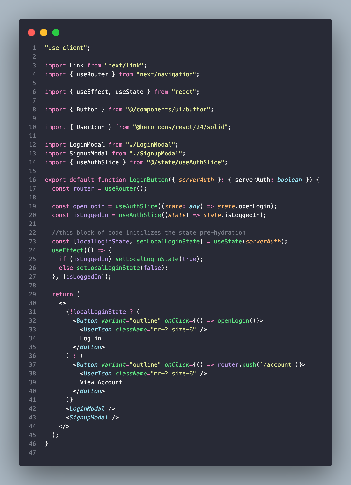

<h1 align="center">
  Clothing Webbshop 🛍️
</h1>
<h3 align="center">
  Fullstack e-handel hemsida
</h3>

  
  
  
  
  
  
  
  
  
  
  
  
    
  
  
  
  
  

---

En fullstack e-handel hemsida byggd som del av mitt gymnasie arbete.

Detta repot innehåller källkoden.

# Innehåll

- [Tech stack och dependencies](#tech-stack-och-dependencies)

- [Databas design](#databas-design)

- [Hosting och deployment](#hosting-och-deployment)

- [Namn conventioner](#namn-conventioner)

- [Problem, problemlösning och lärdomar](#problem-problemlösning-och-lärdomar)

- [Gymnasie arbete](#gymnasie-arbete)

# Tech stack och dependencies

- ## [⚛️ React](https://react.dev/)

  - ### [🔼 Next](https://nextjs.org/)

    Eftersom att jag bygger en webbshop så kommer jag behöva bra SEO. Bra SEO är inte något som en standard SPA erbjuder, så därför blir man tvungen till att antingen server rendera den eller skriva typ rå HTML. Server rendering låter ju trevligare.

    Jag valde att använda mig av nextjs då det typ är det enda sättet att server rendera React och samtidigt använda de nya server komponent mönsterna.

  - ### [🌐 Server komponenter](https://react.dev/learn/start-a-new-react-project#bleeding-edge-react-frameworks)

    Server komponenter är det självklara sättet att göra server rendering och data fetching på. Jag använder de så mycket jag kan.

  - ### State management

    - #### [🐻 Zustand](https://zustand-demo.pmnd.rs/)

      Jag tycker om konceptet med unidirectional data flow och global state som Redux populariserade. Men jag ogillar all setup, boilerplate, och komplexitet som kommer med Redux.

      Jag valde Zustand för att konceptet är identiskt till Redux, men implantationen är betydligt enklare.

    - #### [🔬 Tanstack Query](https://tanstack.com/query/latest)

      Jag valde att använda Tanstack Query i admin panelen för att hantera dels data fetching, och dels caching av data.

    - #### [🔎 Nuqs](https://nuqs.47ng.com/)

      Jag råkade hitta Nuqs i en github tråd när jag letade information om hur man hanterar URL query params i nextjs appar, och Nuqs visade sig vara den perfekta lösningen. APIn är exakt som en useState, men staten synkroniseras automagiskt med URL quires. [Repot förtjänar mer stjärnor](https://github.com/47ng/nuqs)

  - ### Styling

    - #### [🌊 Tailwind](https://tailwindcss.com/)

      I min erfarenhet så är Tailwind det absolut enklaste sättet är göra styling på.

    - #### [⭐ Heroicons](https://heroicons.com/)

      Heroicons brukar vara min go-to för ikoner. De har inte den största urvalet, men alla av ikonerna ser bra ut, och dessutom har de outlineade versioner.

    - #### [🔘 Shadcn/ui](https://ui.shadcn.com/)

      Om man redan använder React och Tailwind så är Shadcn ett självklart val.

      Det som skiljer Shadcn/ui åt all de andra komponent biblioteken är att du själv äger äger komponenterna. Om du vill ändra någonting på de så kan du helt enkelt bara öppna komponenten och ändra det själv.

- ## [🧄 Bun](https://bun.sh/)

  - ### [🔥 Hono](https://hono.dev/)

    Jag valde Hono för att den har ett API som efterliknar express, men är kompatibel med Bun runtime och har allmänt bättre prestanda.

  - ### [🗄️ Drizzle](https://orm.drizzle.team/)

    Jag valde drizzle som min ORM för att APIn efterliknar vanlig SQL.

  - ### [👤 Jose](https://github.com/panva/jose)

    JWT signering och verifiering för att hantera authentication.

  - ### [🔒 Bcrypt](https://github.com/kelektiv/node.bcrypt.js#readme)

    För att kryptera lösenorden.

- ## [🐬 MySQL](https://www.mysql.com/)

  Jag valde mySql som min databas dels för att lära mig något nytt och dels för att en e-handels hemsida är full av relationer, så att SQL passar perfekt

- ## Övrigt

  - ### [🇹 Typescript](https://www.typescriptlang.org/)

    Majoriteten av gångerna så använder jag inte ens Typescript korrekt 😂, men ändå så är det en enorm hjälp för att förebygga buggar, speciellt på backenden, där man inte alltid är säker på vad alla funktioner returnerar

  - ### [🅿️ Prettier](https://prettier.io/) + [eslint](https://eslint.org/)

    Jag vill inte spendera tid och mental energi på att formatera min kod, så jag valde att använda prettier (dock är sidoeffekten att man köttar CMD+S efter typ varje knapp tryck 😂, men det kan jag leva med). Jag använder Import-sort pluginet ifrån trivago och Tailwind-classname-sort-pluginet, de är nicee

    Eslint använder jag helt enkelt med default inställningarna som Nextjs kommer med.

  - ### [🤖 Valibot](https://valibot.dev/)

    Inputs behöver valideras, annars så kommer användare kunna skicka all möjligt skit till backenden, det vill vi inte tillåta.

    Det populäraste validerings biblioteket är nog [Zod](https://zod.dev/). Nackdelen med Zod är att import storleken är (onödigt) stor. Valibot kan ofta ha en import storlek som är 10x mindre än Zod. Och så föredrar jag Valibots dokumentation.

  - ### [📬 Postman](https://www.postman.com/)

    Jag använde Postman mest bara för att kolla formen av min JSON, det är as nice att ha det på andra skärmen.

  - ### [🦫 Dbeaver](https://dbeaver.io/)

    Jag använde Dbeaver för att enklare kunna hantera och visualisera min databas

  - ### [🐳 Docker](https://www.docker.com/)

    Jag använder docker för att förenkla hostingen av min Bun backend

# Databas design

Bilden är en visualisering av databasen skapad med Dbeaver.

Detta var mina krav på databasen:

- Kunna sälja produkter
- Kunna ha olika märken och olika kategorier
- Kunna sälja variationer av produkter, typ storlek och färg
- Kunna ha rabatter på vissa variationer av produkter, men inte andra
- Kunna belysa en viss variation av en produkt
- Kunna ha ha unika bilder på varje variation
- Admins ska kunna se vad alla har i kundvagnarna, tom de som inte är registrerad

Jag valde att bygga ut hela "produkt" grejen med att tänka på varje variation av en produkt som en artikel, och sedan ha anonnser som innehåller flera artiklar. Annonserna behöver därmed också ha någon typ av "default" artikel

# Hosting och deployment

- ## 💻 Frontend

  Jag använder [🔼 Vercel](https://vercel.com/)

- ## 🌐 Backend

  Jag kör min backend kod i en [🐳 Docker](https://www.docker.com/) container med [🚝 Railway](https://railway.app/)

- ## 💾 Databas

  Här använder jag [🚝 Railway](https://railway.app/) igen

# Namn conventioner

- **Databas**: snake_case

- **API Route namn**: kebab-case

- **JS/TS Code**: camelCase

- **Client-Side Storage**: camelCase

- **Types och Schema validering**: PascalCase

- **Enviorment variabel**: SCREAMING_SNAKE_CASE

- **Extra**: Databas tabeller ska ha Tbl som suffix

Jag valde dessa conventioner för att simplifiera och streamlina utvecklings processen och samtidigt följa best-practices. Tanken bakom de är ju att jag som utvecklare inte ska behöva fundera på triviala grejer som namn givning, samt att man inte ska behöver tänka typ "fan, vad heter den endpointen igen?".

# Problem, problemlösning och lärdomar

Detta projekt vart fullt av lärdomar för mig. Jag stötte på alla sorters problem, allt ifrån att jag låste ut mig själv ifrån min egen databas, till att [jag satt i timmar med en ".Dockerfile", som borde hetat "Dockerfile" 😂](https://www.youtube.com/watch?v=D2_r4q2imnQ&ab_channel=GamingSoundFX).

- ## State management

  

  
Läs

  Detta är faktiskt andra gången jag har försökt att bygga detta för fösta gången så blev det kaos pga min state management lösning inte var genomtänkt. _Hela_ Kundvagnen var lagrad i sin egen komponent som låg relativt långt in i DOM trädet, så det blev väldigt svårt för andra komponenter (som köp-knappen) att komma åt den. Jag insåg det rätt snabbt att jag borde ha använt mig av (i alla fall) en context run hela skiten. Men hela dev-ex:en (och därmed min motivation 😂) hann gå till bajs innan jag faktiskt bytte den till en context.

  När jag byggde-om den så viste jag ifrån första början att jag var tvungen att lösa state management på något genomtänkt men samtidigt simpelt sätt. Så jag valde att testa [Zustand](https://zustand-demo.pmnd.rs/), och det funkar fint tycker jag.
  

- ## Behovet av en ORM

  

  
Läs

  Detta är första projektet som jag använde SQL i. När jag började bygga ut backenden så tänkte jag att det skulle gå bra med att skriva rå SQL. Så jag valde att skapa stored procedures, som jag sedan skulle anropa i koden. Jag insåg snabbt att det var ett _väldigt_ dåligt mönster, för jag var ju tvungen till att använda parametrized queries (för att skydda mot SQL-injections) och då blev det ju typ 7 rader kod för en enkel CRUD operation (som dessutom inte ens var type-safe), och koden blev väldigt svårläst.

  Då fick jag den genialiska idén att abstrahera bort de 7 raderna till sin egen funktion. Sen insåg jag hur efterblivet det egentligen var; jag hade skapat en helper funktion för varje stored procedure för att förenkla läsbarheten av koden, men i processen så gjorde jag det mycket värre. Relativt enkla CRUD-operationer hade sina egna helper funktioner som i sin tur kallade på stored procedures, som i sin tur faktiskt utförde CRUD-operationerna i databasen. Man kan ju inte hålla på så om man ska bygga något underhållbart.

  Så jag valde att utforska lite om vilka alternativ som fanns. Jag hamnade mellan [Prisma](https://www.prisma.io/) och [Drizzle](https://orm.drizzle.team/) ORM. Båda verkade vara kompetenta lösningar. Jag råkade dock radera hela min databas när jag försökte insallera [Prisma](https://www.prisma.io/) (jag missuppfattade vad "database migration" egentligen syftar på 😂), så frustrationen ledde mig till [🗄️ Drizzle](https://orm.drizzle.team/) 😂.

  Jag tycker faktiskt att [Drizzle](https://orm.drizzle.team/) passade bättre än [Prisma](https://www.prisma.io/). pga att APIn efterliknar vanligt SQL-kod (som jag fösöker bli mer bekant med).
  

- ## Stateless backend och singleton(-ish) design

  

  
Läs

  State i backend är ett helt nytt koncept för mig, före detta projektet så tänkte jag aldrig ens på det. API ruttarna i [Next](https://vercel.com/) är stateless, i mitt fall så är det ett problem eftersom att det betyder att vartenda rutt kommer att göra sin egen anslutning till databasen. Då hade jag min databas på RDS som hade en max-anslutning på 60, och när man har [Next](https://vercel.com/) i dev-mode så kommer anslutningarna inte att disconnecta på hot-realods, så att de 60 anslutningarna fylldes jävligt snabbt.

  Varje individuella rutt har ju sin egen state, så först tänkte jag att jag kanske skulle kunna utnytja det genom att ha någon typ av intern rutt som returnerar databas anslutnings objektet. Men det visade sig komplexa objekt (som databas anslutningar) inte kunnde skickas genom HTTP :(.

  Själv tycker jag att [Next](https://vercel.com/) borde ha någon inbyggd lösning på detta, men samtidigt så kommer de ju aldrig göra det med tankte på att de tror att man borde göra typ allt i server-komponenter.

  Lösningen är ju att man har någon typ av "pooling". [Prisma](https://www.prisma.io/) har nått magiskt rust-lager som hjälper till med det, men jag valde ju [Drizzle](https://orm.drizzle.team/) 💀. Som tur är så kan man ju också ha pooling på databas-nivå, jag försökte fixa det i min AWS RDS panel, men det ville inte fungera, så jag bestämde mig för att bygga-om min backend med Bun och Hono.

  Motivationen till det var dels också att jag började ogilla file-based-routing mer och mer. Jag tycker att file-based-routing fungerar fint på frontenden, men inte på backenden. Motivationen till bygga om den var dels också att [Next](https://vercel.com/) inte har någon riktig middleware lösning för backend rutter, och jag var tvungen att ha typ 10 rader boiler-plate kod i varje "admin/" rutt bara för att checka-av om anropet faktisk kom ifrån en admin.

  Rent tekniskt så är väll anslutningen inte riktigt singelton eftersom jag använder "mysql.createPool". Jag gör det pga att jag stötte på någon typ av timeout-bug där anslutningen stängdes efter någon timme, men det var omöjligt att detektera det (förutom om man vill wrappa varje endpoint i en try-catch, vilket man ju inte vill). mysql.createPool hanterar sådana grejer åt mig.
  

- ## Client-side caching på i admin panelen

  

  
Läs

  Första gången jag byggde ut admin panelen så tänkte jag att jag skulle använda server-komponenter, men det visade sig vara ett rätt dumt val. Server-komponenter renderas ju på servern, när webbläsaren tar emot de som cachar den de. Det betyder att trots att innehållet kan ha ändrats så kommer webbläsaren visa den cachade verisonen och _inte_ be servern efter en ny. I praktiken så betyder det att man kan lägga till en artikel i admin/articles/add, och sedan när man kommer tillbaks till admin/articles så kommer den nya artikeln inte visas. Denna chachingen går inte att stänga av. Dokumentationen säger (komiskt nog) typ bara "nej".

  Pga av att innehållet på admin panelen är väldigt interaktivt så är det nog smartare att bygga ut data fetchingen på clienten istället. Jag har aldrig använt react query innan, men här passar den faktiskt perfekt.

  

  

- ## Att hosta en bun API

  

  
Läs

  Bun är en relativt ny grej och därmed finns det inga bra no-bullshit guider på att hosta det. Efter lite googling så kom jag fram till att jag var tvungen till att kötta ner den i en docker container. [Det finns ju nån officiala Dockerfile template på Bun:s hemsida](https://bun.sh/guides/ecosystem/docker), men jag valde att använda en ifån nån artikel på Medium för att den verkade mycket mer simpel.

  Nästa steg blev då att hitta något system för att hosta dockerfilen. AWS har ju EC2 eller Lambda, men komplexiteten är jävligt hög, (jag vet inte riktigt hur det hade fungerat, men jag antar) att jag hade först behövt göra någon typ av automatisering som lyssnar på commits på github repot, sen hämtar dockerfilen och bygger en docker image ifrån den, och sedan hostar den på EC2 eller Lambda. Det låter cp-komplicerat, jag ville ha något mer simpelt.

  Med [Render](https://render.com/) kan man bara koppla github repot och sen _bara funkar det_, och de verkade stödja docker, men cold-startsen är brutala (typ 1min). Senare hittade jag att [Railway](https://railway.app/) också kunde deploya docker (där är cold-startsen helt okej).
  

- ## State initialisering innan hydration

  

  
Läs

  "Login" knappen är någonting som är beroände av state. Om användaren är inloggad så ska det stå "view account", om den inte är inloggad så ska det stå "login". Staten går att initialisera på clienten med javascript, men om användaren inloggad så kommer det stå "login" innan sidan hydratisera. Det ser konstigt ut, så jag initialiserade staten med en serverkomponent, sedan tar clienten över.

  Lösningen är inte 100% optimal eftersom den orsakar en extra rerender, men navigationen är en väldigt viktig del av UX, så det får man ta.

  

  Railway app har samma problem, men de har inte löst det hah

  

# Gymnasie arbete

Detta är också mitt gymnasie arbete

# TODO

## prio 1

- [ ] Streamline input validation and form submission across the app

## prio 2

- [ ] Add success screen after payment?
- [ ] Add to orders table after successful payment??
- [ ] Add stastics to admin panel
- [ ] Find email provider and setup forgot password system

## prio 3

- [ ] probably shouldn't store user info (apart from userId) on the client
- [ ] remove a bunch of unsused console logs
- [ ] Make so buyers can submit reviews
- [ ] Ai integration??? like talk with the cart? let the ai modify the cart??

---

- [x] Integrate stripe
- [x] fix error on editing listing, dunno why
- [x] Present account info in a cleaner way, and make it editable
- [x] Add planned sales shit
- [x] Fix bug with red hoodie,
- [x] get nav links from the backend, also put in so that the "listing view page" has a link to view the brand, and a link to view the category
- [x] Build filter/browse section of the website
- [x] Fix weird (race condition?) bug with cart state syncing (probably caused by incorrect implementation of debouncing, would probably be fixed by removing debouncing entierly)
- [x] Build search functionality? (dunno how, but i'll find out)
- [x] FIX BUG where the backend tries to send commands to the database, even though the connection is closed (kinda fixed maybe??)
- [ ] Write some tests? idk
- [ ] Write a nice readme
- [ ] Translate readme

---

- [ ] Write GA loggbok from commit history
- [ ] Chill
